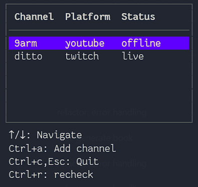

# Live Stream Checker 📺

A terminal-based application for monitoring the live status of Twitch and YouTube streamers. Built with Go and featuring a beautiful TUI (Terminal User Interface) powered by Bubble Tea.



### Getting API Credentials

#### Twitch API
1. Visit the [Twitch Developer Console](https://dev.twitch.tv/console)
2. Create a new application
3. Copy the Client ID and generate a Client Secret

#### YouTube Data API
1. Go to the [Google Cloud Console](https://console.cloud.google.com/)
2. Create a new project or select an existing one
3. Enable the YouTube Data API v3
4. Create credentials (API Key)

#### Env example
```env
GOOGLE_API_KEY={YOUR_GOOGLE_API_KEY}
TWITCH_CLIENT_ID={YOUR_TWITCH_CLIENT_ID}
TWITCH_CLIENT_SECRET={YOUR_TWITCH_CLIENT_SECRET}
```

**Supported platforms:**
- [x] Twitch 
- [x] Youtube
